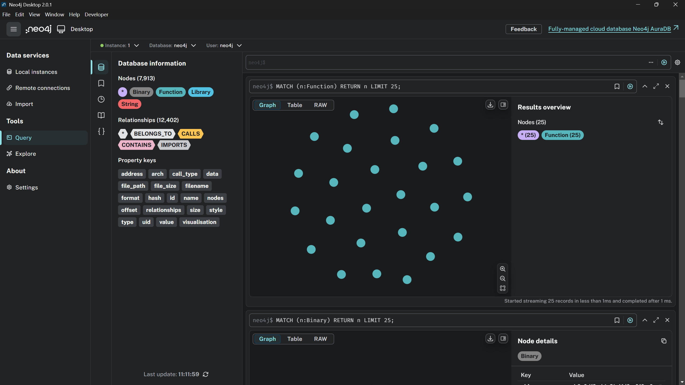
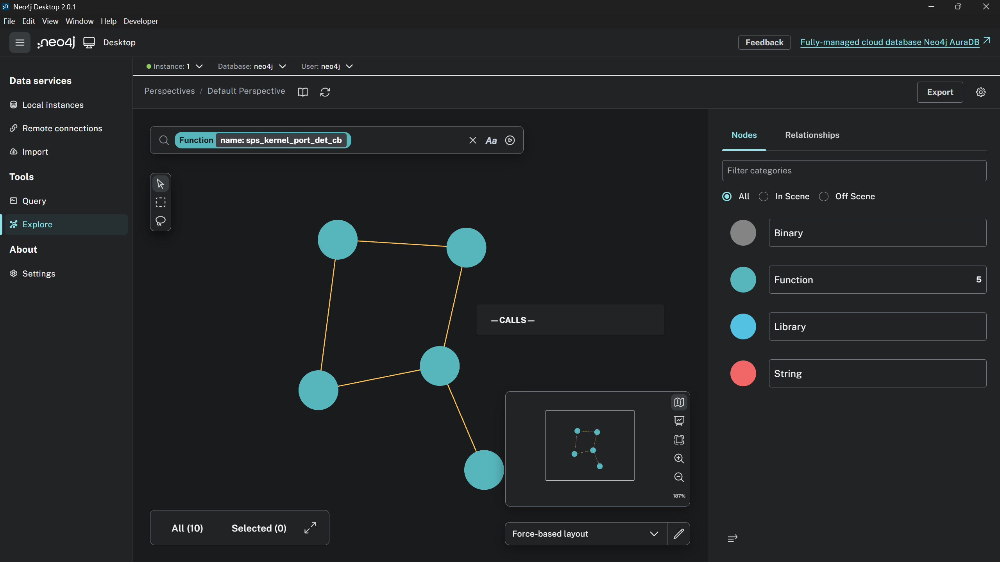

# BinaryX-Graph

Cross-binary analysis data importer written in Rust, focused on importing pre-analyzed binary data into Neo4j graph database for graph analysis.

## Features

- **Fulltext Search**: Built-in Lucene-based fulltext index for fast substring/keyword search in strings
- **Neo4j Integration**: Native neo4rs driver for direct Neo4j database connection
- **Modern CLI**: Command-line interface based on clap with multiple output formats
- **Flexible Configuration**: JSON configuration file support
- **Single Deployment**: Compiled as a single executable with no runtime dependencies
- **Call Path Analysis**: Complete function call chain and execution order analysis, solving the "who calls whom and in what order" problem
- **Upward Call Chain**: Trace function call sources to build complete call context
- **Recursion Detection**: Automatically identify direct and indirect recursive calls to prevent infinite loops
- **Execution Order**: Precise execution timing analysis based on call addresses

### Installation

#### Build from source

```bash
git clone https://github.com/yourusername/BinaryX-Graph.git
cd BinaryX-Graph
cargo build --release
```

### Configuration

Create configuration file `config.json`:

```json
{
    "neo4j_uri": "bolt://localhost:7687",
    "neo4j_user": "neo4j",
    "neo4j_password": "your_password_here",
    "neo4j_database": null,
    "batch_size": 1000
}
```

**Configuration field descriptions:**

- `neo4j_uri`: Neo4j database connection address (required)
- `neo4j_user`: Neo4j username (required)
- `neo4j_password`: Neo4j password (required)
- `neo4j_database`: Custom database name (optional)
  - Set to `null` or omit: Use the default database configured in Neo4j server
  - Set to string: Connect to the specified database, e.g., `"my_analysis_db"`
- `batch_size`: Number of files processed per batch during bulk import (optional, default: 1000)
  - Used to control the number of files processed per batch during directory bulk import
  - Larger batches may improve processing speed but increase memory usage
  - Recommended values: 100-5000, adjust based on file size and system memory

### Basic Usage

#### 1. Initialize Database

```bash
# Create constraints and indexes
./binaryx -c config.json database init
```

#### 2. Import Data

```bash
# Import a single JSON file
./binaryx -c config.json import json analysis.json

# Bulk import JSON files from a directory (using batch_size from config)
./binaryx -c config.json import directory ./analysis_data --pattern "*.json"

# Bulk import with specified batch size
./binaryx -c config.json import directory ./analysis_data --pattern "*.json" --batch-size 500

# Skip validation during bulk import (for faster processing)
./binaryx -c config.json import directory ./analysis_data --no-validate
```

#### 3. Query Data

```bash
# Query functions from all binaries
./binaryx -c config.json query functions --pattern "main"

# Fulltext search strings (keyword/substring search with auto wildcard)
./binaryx -c config.json query strings --pattern "Pay Bitcoin"

# Fulltext search with raw Lucene query syntax
./binaryx -c config.json query strings --pattern "ransom* AND (bitcoin OR wallet)" --raw

# Search strings in a specific binary
./binaryx -c config.json query strings --pattern "password" --binary "malware.exe"

# Query functions from a specific binary
./binaryx -c config.json query functions --pattern "main" --binary "sample.exe"

# View binary information
./binaryx -c config.json query binary --binary-name "sample.exe"

# View call graph for a specific binary
./binaryx -c config.json query callgraph main --binary "sample.exe" --max-depth 3

# View call graph for all binaries
./binaryx -c config.json query callgraph main --max-depth 3

# Complete call path and execution order analysis for a specific binary
./binaryx -c config.json query call-path "main" --binary "sample.exe"

# View call paths (downward calls)
./binaryx -c config.json query call-path "main" --binary "sample.exe" --show-paths --max-depth 3

# View call sequences (execution order)
./binaryx -c config.json query call-path "main" --show-sequences

# View upward call chain (who called this function)
./binaryx -c config.json query call-path "main" --show-upward --max-depth 3

# Complete call context analysis
./binaryx -c config.json query call-path "main" --show-context

# View cross-references for a specific binary
./binaryx -c config.json query xrefs 0x401000 --binary "sample.exe"

# Export as JSON format
./binaryx -c config.json query call-path "main" --format json > analysis.json
```

**Binary Filtering Description:**

- The `--binary` parameter supports filtering by **filename**, e.g., `--binary "sample.exe"`
- Also supports filtering by **SHA256 hash**, e.g., `--binary "abc123..."`
- Filtering uses **contains matching**, supporting partial matches (e.g., `--binary "sample"` will match "sample.exe")
- When **not specifying `--binary`**, queries return results from all imported binary files
- Applicable to `query functions`, `query callgraph`, `query xrefs`, `query call-path` commands

#### 4. Database Management

```bash
# View statistics
./binaryx -c config.json database stats

# Export data
./binaryx -c config.json database export backup.json

# Clear database (use with caution)
./binaryx -c config.json database clear --confirm
```

#### 5. Use in Neo4j Desktop



## Architecture Design

BinaryX-Graph adopts a modular architecture design, providing clear separation of concerns:

```
BinaryX-Graph
├── src/
│   ├── main.rs              # Application entry point
│   ├── lib.rs               # Library interface
│   ├── cli.rs               # CLI argument parsing
│   ├── config.rs            # Configuration management
│   ├── models/              # Data model layer
│   │   ├── nodes.rs         # Node models
│   │   ├── relationships.rs # Relationship models
│   │   └── call_path.rs     # Call path models
│   ├── neo4j/               # Neo4j database layer
│   │   ├── connection.rs    # Connection management
│   │   ├── importer.rs      # Data import
│   │   ├── schema.rs        # Schema management
│   │   └── call_path_analyzer.rs # Call path analyzer
│   ├── api/                 # High-level API layer
│   │   ├── client.rs        # Client interface
│   │   └── session.rs       # Session management
│   ├── utils/               # Utility functions
│   │   └── uid.rs           # UID generation
│   └── commands/            # CLI commands
│       ├── import.rs        # Import commands
│       ├── query.rs         # Query commands (enhanced)
│       └── database.rs      # Database commands
├── tests/                   # Test files
├── examples/                # Example data
└── Cargo.toml               # Project configuration
```

## Multi-Binary Support

BinaryX-Graph fully supports the import and analysis of multiple binary files. Each binary file is uniquely identified by its SHA-256 hash, and all related nodes and relationships are associated with their corresponding binary file.

### UID Format Description

To support cross-binary de-duplication and shared analysis, the system uses the following **global deduplication UID format**:

| Node Type           | UID Format                             | Example                                 | Scope           |
| ------------------- | -------------------------------------- | --------------------------------------- | --------------- |
| Binary              | `{sha256}`                             | `abc123...def`                          | Per-binary      |
| Function (Internal) | `{binary_hash}:{address}`              | `abc123:0x401000`                       | Per-binary      |
| Function (Import)   | `imp:{library}:{name}`                 | `imp:kernel32:createfilea`              | Global          |
| Function (Export)   | `{binary_hash}:{address}`              | `abc123:0x401000`                       | Per-binary      |
| String              | `str:{SHA256(content)}`                | `str:185f8db3227...`                    | Global          |
| Library             | `{name_lowercase}`                     | `kernel32`                              | Global          |

### Relationship Description

| Relationship Type | From     | To       | Properties        | Description                                    |
| ----------------- | -------- | -------- | ----------------- | ---------------------------------------------- |
| CONTAINS          | Binary   | Function | -                 | Functions contained in the binary file (internal/export) |
| IMPORTS           | Binary   | Function | address           | Imported APIs referenced by the binary file    |
| IMPORTS_LIBRARY   | Binary   | Library  | -                 | Libraries imported by the binary file          |
| BELONGS_TO        | Function | Library  | -                 | Library to which the imported function belongs |
| CALLS             | Function | Function | offset, call_type | Function call relationships                    |
| CONTAINS_STRING   | Binary   | String   | address           | Strings referenced by the binary file          |

**Multi-Binary Advantages:**

- Functions with the same name from different binaries do not conflict
- Cross-sample analysis: Instant queries like "which malware uses this API/string"
- Malware clustering: Group samples by shared API calls and string signatures
- Comparative analysis of different binary versions is supported
- Track dependencies through Binary-IMPORTS->Library relationships
- Support filtering queries for specific binaries using the `--binary` parameter

## Data Format

Use data formats generated by [BinaryX-IDA](https://github.com/waiwai24/BinaryX-IDA), format example as follows:

```json
{
  "binary_info": {
    "name": "",
    "file_path": "",
    "file_size": ,
    "file_type": {
      "type": "",
      "architecture": ""
    },
    "hashes": {
      "sha256": ""
    }
  },
  "functions": [
    {
      "name": "",
      "address": "",
      "size": 
    }
  ],
  "imports": [
    {
      "name": "",
      "address": "",
      "library": ""
    }
  ],
  "exports": [
    {
      "name": "",
      "address": "",
      "ordinal": 
    }
  ],
  "strings": [
    {
      "value": "",
      "address": "",
      "length": ,
      "type": ""
    }
  ],
  "calls": [
    {
      "from_address": "",
      "to_address": "",
      "offset": "",
      "type": ""
    }
  ]
}
```

### Field Descriptions

#### binary_info Fields

| Field Path                             | Type   | Description                              | Required | Stored | Notes                                          |
| -------------------------------------- | ------ | ---------------------------------------- | -------- | ------ | ---------------------------------------------- |
| `binary_info.name`                   | String | Binary filename                          | ✅       | ✅     | Stored as filename attribute                   |
| `binary_info.file_path`              | String | Complete binary file path                | ✅       | ✅     | Full path information                          |
| `binary_info.file_size`              | Number | File size (bytes)                        | ✅       | ✅     | Stored as i64 format                           |
| `binary_info.file_type.type`         | String | File format type (PE/ELF/MACH-O)         | ✅       | ✅     | Supports contains matching (PE32, ELF64, etc.) |
| `binary_info.file_type.architecture` | String | Target architecture (e.g., x86_64)       | ✅       | ✅     | -                                              |
| `binary_info.hashes.sha256`          | String | SHA-256 hash (used as unique identifier) | ✅       | ✅     | Used as primary key for Binary node            |

#### functions Fields

| Field Path              | Type   | Description                    | Required | Stored | Notes                         |
| ----------------------- | ------ | ------------------------------ | -------- | ------ | ----------------------------- |
| `functions[].name`    | String | Function name                  | ✅       | ✅     | -                             |
| `functions[].address` | String | Function address (hexadecimal) | ✅       | ✅     | Used to construct UID         |
| `functions[].size`    | Number | Function size (bytes)          | ❌       | ✅     | Optional field, stored as i64 |

#### strings Fields

| Field Path            | Type   | Description              | Required | Stored | Notes                         |
| --------------------- | ------ | ------------------------ | -------- | ------ | ----------------------------- |
| `strings[].value`   | String | String content           | ✅       | ✅     | Used to generate content_hash |
| `strings[].address` | String | String address in binary | ❌       | ✅     | Optional field                |

#### imports Fields

| Field Path            | Type   | Description                        | Required | Stored | Notes                                |
| --------------------- | ------ | ---------------------------------- | -------- | ------ | ------------------------------------ |
| `imports[].name`    | String | Imported function name             | ✅       | ✅     | Used to construct UID                |
| `imports[].library` | String | Library name                       | ✅       | ✅     | Automatically converted to lowercase |
| `imports[].address` | String | Import Address Table (IAT) address | ✅       | ✅     | Used to construct UID                |

**Note:** Imported functions will create the following relationships:

- `Binary-[:IMPORTS]->Library`: Binary imports library relationship
- `Function-[:BELONGS_TO]->Library`: Imported function's library relationship

#### exports Fields

| Field Path            | Type   | Description               | Required | Stored | Notes                 |
| --------------------- | ------ | ------------------------- | -------- | ------ | --------------------- |
| `exports[].name`    | String | Exported function name    | ✅       | ✅     | -                     |
| `exports[].address` | String | Exported function address | ✅       | ✅     | Used to construct UID |

#### calls Fields

| Field Path               | Type   | Description                              | Required | Stored | Notes                             |
| ------------------------ | ------ | ---------------------------------------- | -------- | ------ | --------------------------------- |
| `calls[].from_address` | String | Call source address                      | ✅       | ✅     | Used to match source function     |
| `calls[].to_address`   | String | Call target address                      | ✅       | ✅     | Used to match target function     |
| `calls[].offset`       | String | Call instruction offset                  | ✅       | ✅     | Stored in relationship attributes |
| `calls[].type`         | String | Call type (direct/indirect/virtual/tail) | ✅       | ✅     | Stored as call_type attribute     |

**Note:** The system automatically performs address normalization matching, supporting different address format representations (e.g., 0x401000, 401000, etc.).

## TODO

- [ ] Web UI interface development
- [ ] Native Cypher language query interface

## Contact

 **Issues**: [GitHub Issues](https://github.com/waiwai24/BinaryX-Graph/issues/new)

## License

This project is licensed under the MIT License - see the [LICENSE](LICENSE) file for details.
